# PCAP Forensic Analyzer

An interactive cybersecurity tool for automated analysis of **PCAP** and **PCAPNG** network captures. The project complements Wireshark by automating repetitive digital forensics and incident response (DFIR) tasks such as threat detection, IOC extraction, forensic reporting, and traffic visualization.

---

## Why this exists

Wireshark is an industry-standard packet analyzer and excels at protocol-level inspection. However, forensic investigations often require additional manual effort to identify suspicious activity, extract Indicators of Compromise (IOCs), and prepare investigation reports.

This project focuses on **automating those investigation tasks**, enabling faster triage of packet captures while still allowing analysts to use Wireshark for detailed packet inspection when required.

| Manual Wireshark Workflow | PCAP Forensic Analyzer |
|---------------------------|------------------------|
| Manual packet inspection | Automated traffic analysis dashboard |
| Manual IOC extraction | One-click extraction of external IPs, domains and URLs |
| Manual report writing | Automatic Markdown forensic report generation |
| Manual threat hunting | Rule-based threat detection modules |
| Limited visualization | Interactive charts, timeline and communication graph |
| Requires display-filter expertise | Beginner-friendly dashboard interface |

---

# Features

### Packet Analysis
- Upload and analyze **PCAP** and **PCAPNG** files
- Automatic packet parsing
- Packet statistics and protocol distribution
- Source and destination IP analysis
- Interactive packet viewer

### Threat Detection
The analyzer automatically detects common suspicious behaviors including:

- **Port Scan Detection**
  - Identifies hosts attempting connections to many destination ports within a short time window.

- **Beaconing Detection**
  - Detects periodic communication patterns commonly associated with Command & Control (C2) traffic.

- **DNS Tunneling Detection**
  - Flags suspicious DNS traffic based on query frequency and entropy.

- **Plaintext Credential Detection**
  - Detects credentials transmitted over insecure protocols including HTTP, FTP and Telnet.

---

### IOC (Indicators of Compromise) Extraction

Automatically extracts:

- External IP addresses
- Domains
- URLs

with downloadable CSV export.

---

### Evidence Integrity

Generates cryptographic hashes for uploaded evidence:

- MD5
- SHA1
- SHA256

These hashes help verify the integrity of the original capture during forensic investigations.

---

### Interactive Dashboard

The Streamlit dashboard includes:

- 📊 Packet Statistics
- 📈 Protocol Distribution Charts
- 🌐 Network Communication Graph
- 🕒 Traffic Timeline
- 📡 Top Source IPs
- 📡 Top Destination IPs
- 🔍 Packet Viewer
- 🚨 Threat Detection Results
- 🛡 IOC Extraction
- 📄 Investigation Report

---

### Report Generation

Automatically generates a structured forensic report containing:

- Capture Summary
- Protocol Distribution
- Threat Detection Results
- IOC Summary
- Alert Statistics

Reports can be downloaded as Markdown for documentation or further conversion to PDF if required.

---

# Project Structure

```
pcap-analyzer/
│
├── app.py                         # Streamlit dashboard
├── main.py                        # CLI interface
├── models.py                      # PacketRecord data model
├── pcap_parser.py                 # PCAP parser using Scapy
├── calculate_statistics.py        # Packet statistics
├── communication_graph.py         # Network graph visualization
├── hashing.py                     # Evidence hashing
├── ioc_extractor.py               # IOC extraction
├── report_generator.py            # Markdown report generation
│
├── detectors/
│   ├── port_scan.py
│   ├── beaconing.py
│   ├── dns_tunneling.py
│   └── plaintext_creds.py
│
├── visualization/
│
├── tests/
│   └── test_detectors.py
│
├── samples/
│
├── reports/
│
├── requirements.txt
└── README.md
```

---

# Installation

Clone the repository

```bash
git clone https://github.com/jiyag410-sketch/pcap-analyzer.git

cd pcap-analyzer
```

Create a virtual environment

```bash
python -m venv .venv
```

Activate it

### Windows

```bash
.venv\Scripts\activate
```

### Linux/macOS

```bash
source .venv/bin/activate
```

Install dependencies

```bash
pip install -r requirements.txt
```

---

# Usage

## Command Line Interface

```bash
python main.py samples/capture.pcap --report reports/report.md
```

---

## Streamlit Dashboard

```bash
streamlit run app.py
```

The application will open in your browser.

Upload any supported **.pcap** or **.pcapng** file to begin analysis.

---

# Analysis Workflow

1. Upload a PCAP/PCAPNG file.
2. Parse network packets.
3. Calculate packet statistics.
4. Extract Indicators of Compromise.
5. Execute threat detection modules.
6. Visualize traffic patterns.
7. Generate investigation report.
8. Download forensic report.

---

# Threat Detection Modules

| Detector | Description |
|-----------|-------------|
| Port Scan | Detects rapid connections to multiple destination ports |
| Beaconing | Detects periodic communication indicating possible C2 traffic |
| DNS Tunneling | Detects abnormal DNS behaviour |
| Plaintext Credentials | Detects credentials transmitted without encryption |

---

# Dashboard Modules

- Dashboard Overview
- Packet Statistics
- Protocol Distribution
- Source IP Analysis
- Destination IP Analysis
- Threat Detection
- IOC Extraction
- Packet Viewer
- Network Communication Graph
- Timeline Visualization
- Investigation Report

---

# Testing

Run unit tests

```bash
pytest tests/ -v
```

Real-world captures can be obtained from

https://www.malware-traffic-analysis.net/

---

# Screenshots

Screenshots of:
-Pcap Analyzer
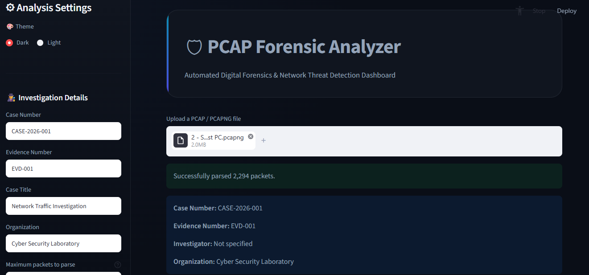

-Password Credentials
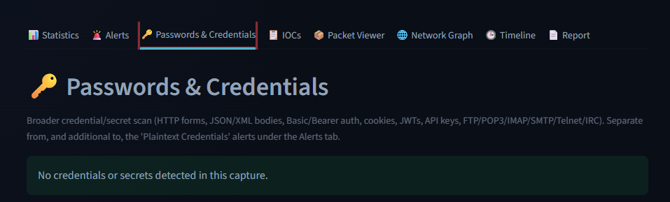

- Dashboard
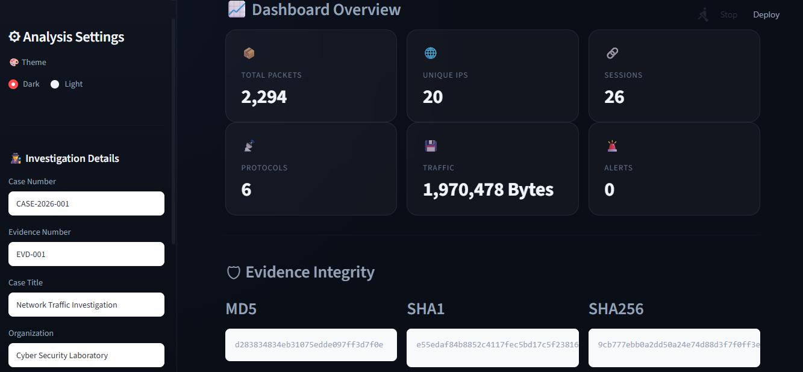

-Evidence Integrity
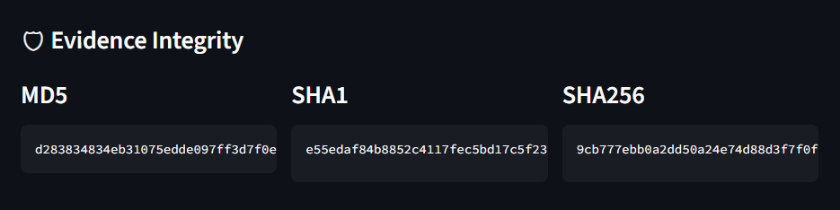

-Packet Viewer
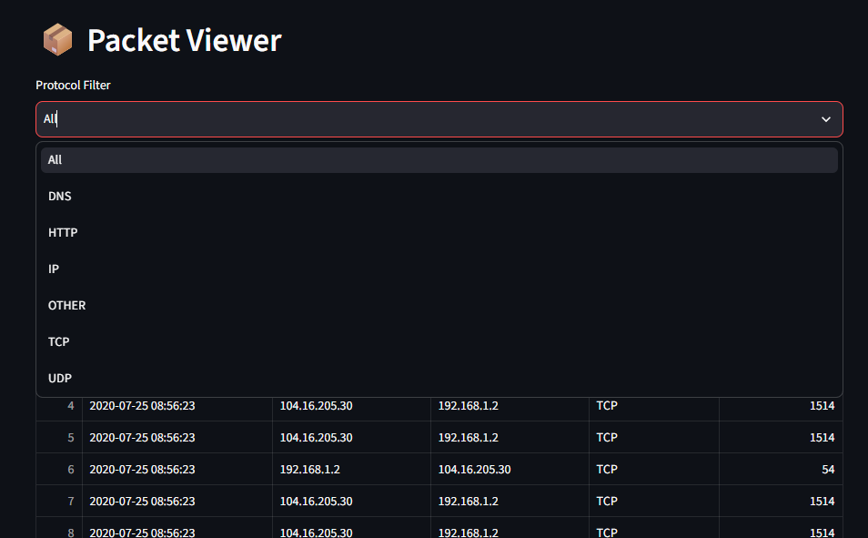

- Statistics
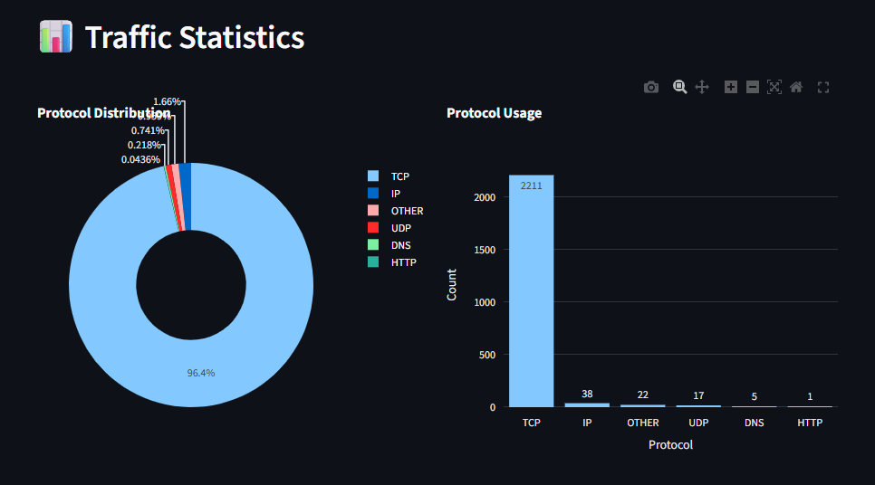

- Threat Detection
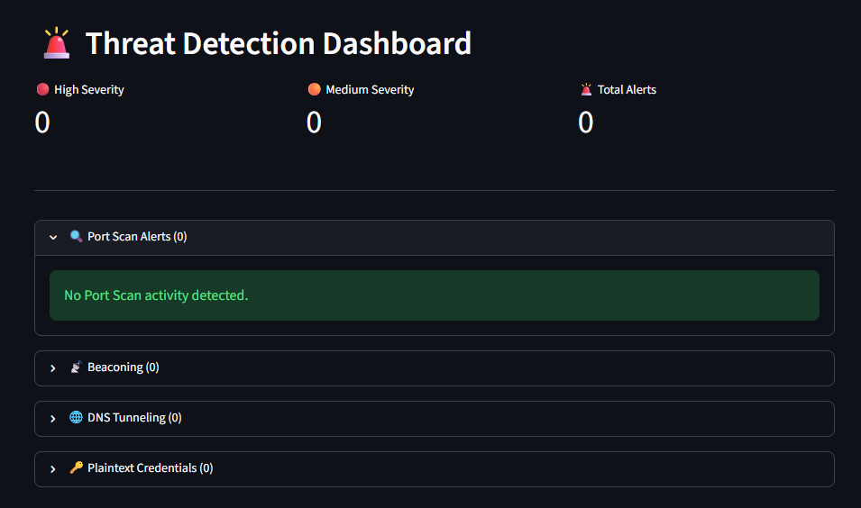

- IOC Extraction
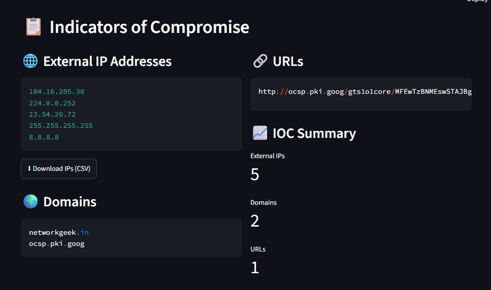

- Network Graph
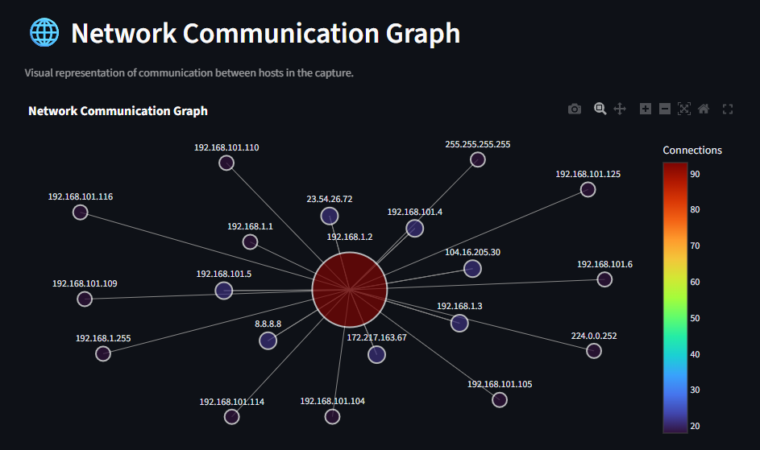

- Timeline
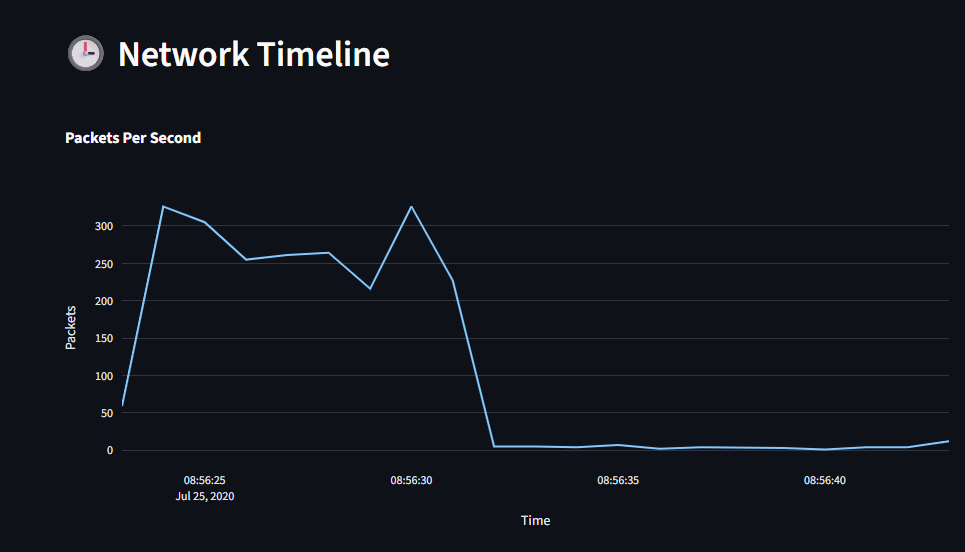

- Investigation Report
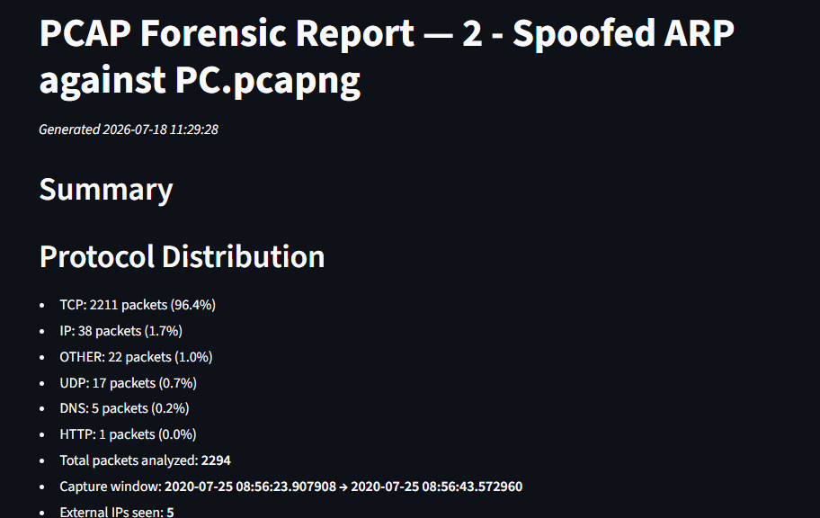

-Pdf Generation
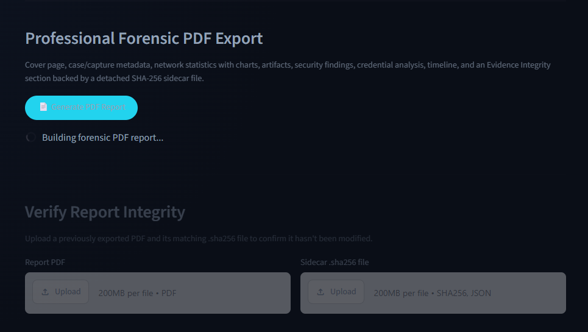


---

# Future Enhancements

Potential improvements include:

- Live packet capture support
- Geo-IP visualization
- VirusTotal integration
- AbuseIPDB enrichment
- Machine Learning based anomaly detection
- Additional detectors
  - ARP Spoofing
  - DHCP Rogue Detection
  - Data Exfiltration Detection

---

# Contributing

Contributions are welcome.

Possible contribution areas include:

- New detection modules
- Additional visualization dashboards
- Performance optimization
- Improved forensic reporting
- Unit testing

---

# License

This project was developed for academic and educational purposes.

---

# Author

**Jiya Gupta**

Bachelor of Technology (Computer Science & Engineering)- 4th year

Birla Institute of Technology, Mesra, Ranchi


---

# Acknowledgements

- Scapy
- Streamlit
- Plotly
- NetworkX
- Pandas
- Wireshark
- Malware Traffic Analysis
